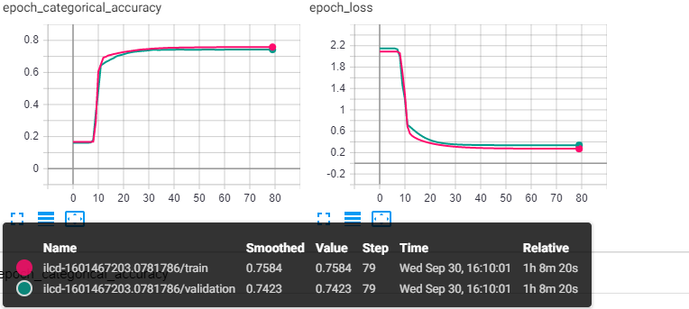

# Lab4

## 1) Пошаговое затухание
        ``` 
    initial_lrate = 0.0001
    drop = 0.5         
    epochs_drop = 10.0   
        ```
  
 
  
  
   Красный график соответствует тестовой выборке, Голубой - валидационной 

  
  ## 2) Экспоненциальное затухание
        ``` 
     initial_lrate = 0.0001
     k = 0.1
        ```
   Оранжевый график соответствует тестовой выборке, Синий - валидационной 
  
  
  
   ## 3) Пошаговое затухание с предворительным разогревом  
         ``` 
        initial_lrate = 0.00001
    drop = 0.5
    epochs_drop = 20.0
    start_lr = 0.000000000000001   
         ```
  
  
  
   ## 4)   Экспоненциальное затухание с предворительным разогревом
        ``` 
    initial_lrate = 0.00001
   start_lr = 0
   finish_lr = 0.000000000000001
   length = 10
   k = 0.1
        ```
  
